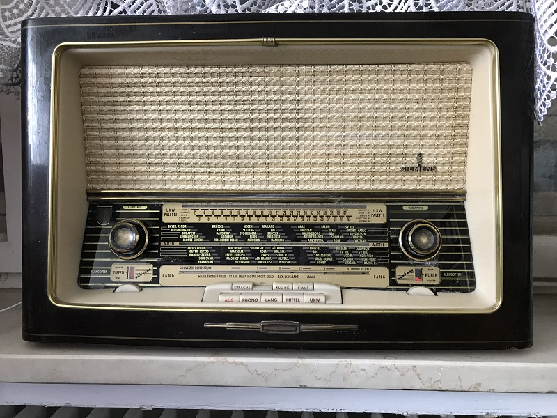
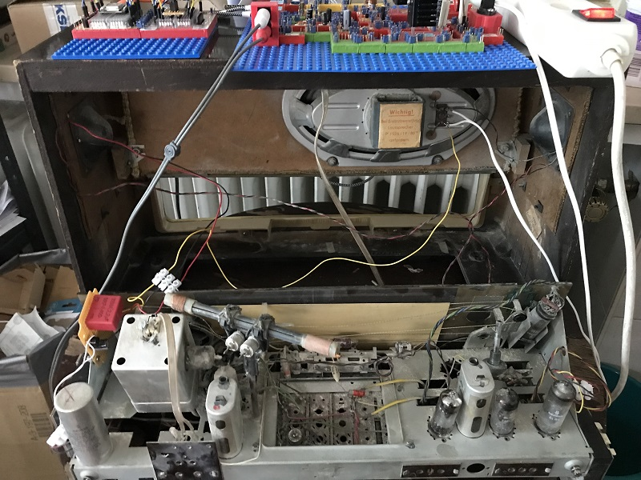
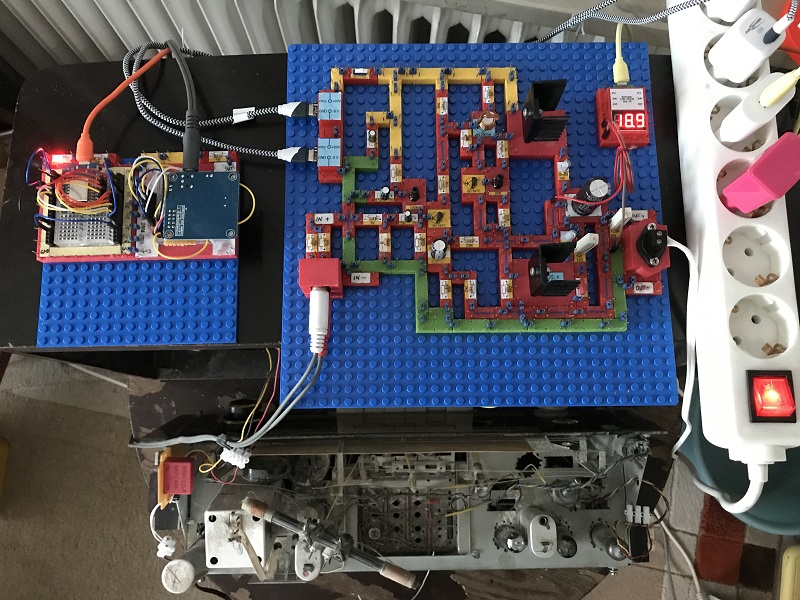
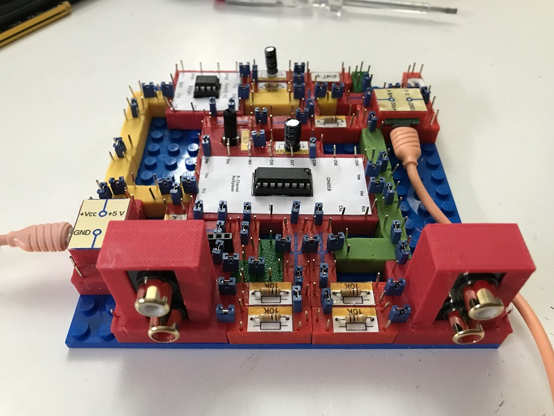
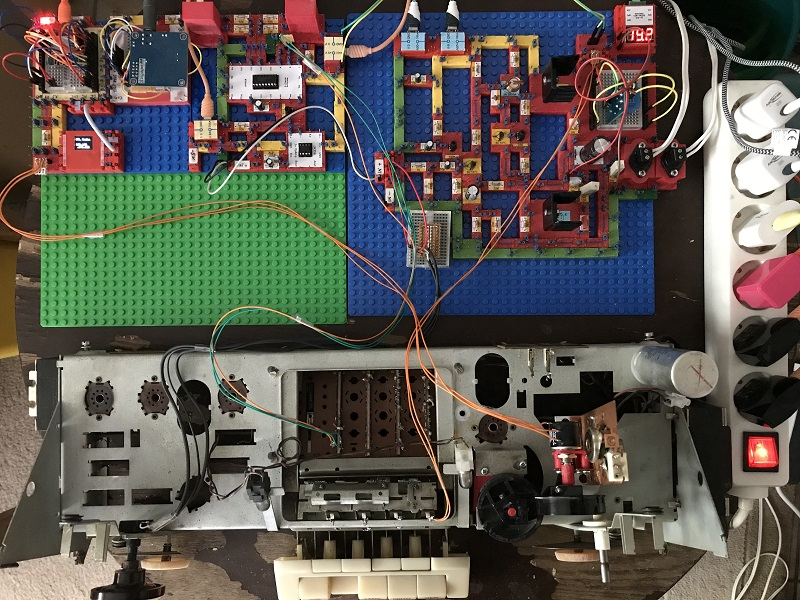
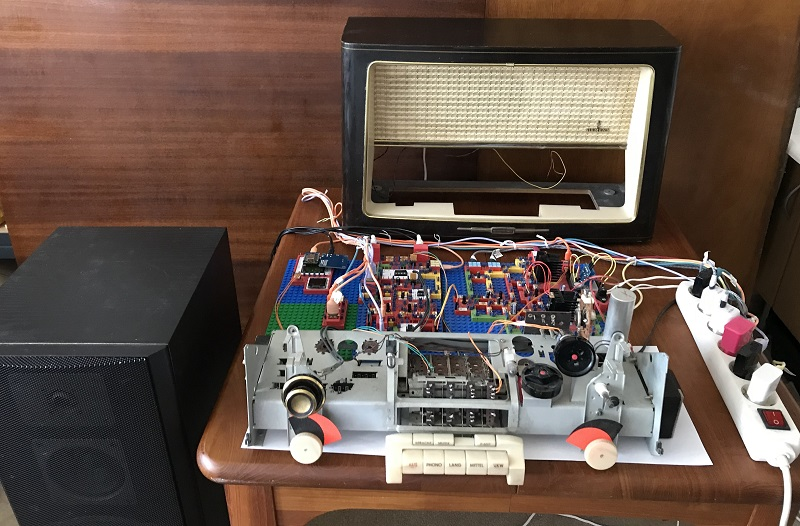
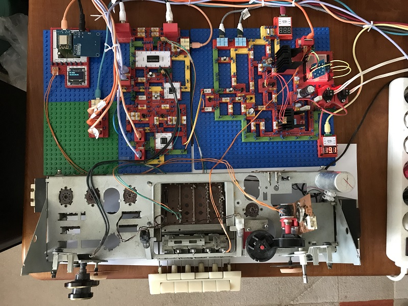
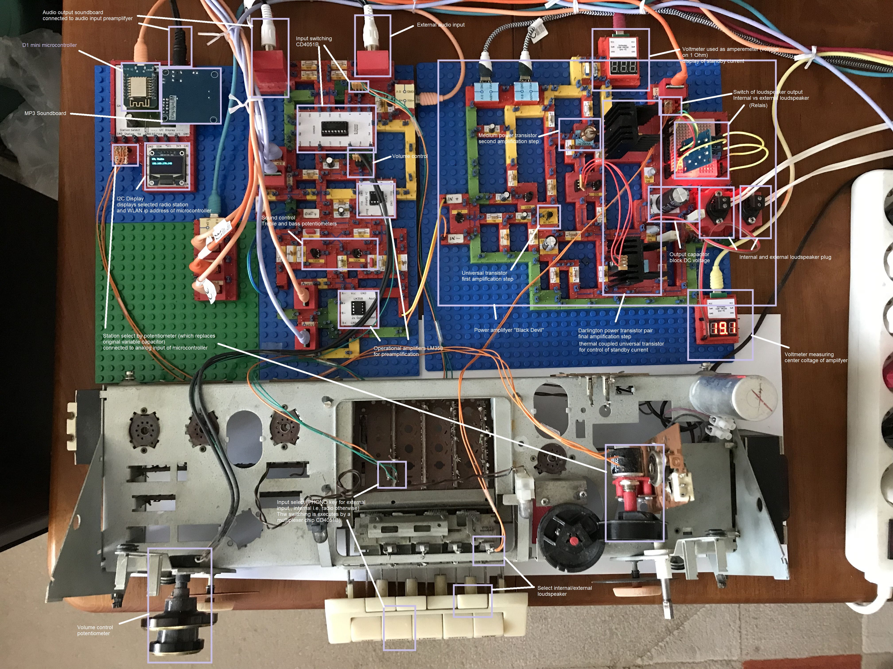

# Electronics With Bricks: Projects

I myself use the electronic construction kit for a number of private projects that I would like to present here. Please keep in mind, that everything presented here is for entertainment and information only. The presented projects are potentially dangerous and you should not try to reproduce any of them.

## Tube radio goes WLAN

After I found an old, broken tube radio in the attic, I had to think of my youth, when we had great fun with the speakers from such old devices together with homemade amplifiers.

Here is the radio I found:

So I came up with the plan to build a modern radio using the chassis of the old radio including speakers and the controls on the front.

To do this, the most of the internal structure of the radio has to be removed and replaced with modern electronics. To test the new electronics, I will first build them using the electronics kit. Later, a circuit board will be designed that can be installed in the radio chassis.

The first step of the project looked likes this:

The new radio functionality is implemented on two breadboard bricks, the first carries a D1 mini mcu, the second carries a VS1053 mp3 module. The software of the mcu is based on Edzelf's internet radio solution. The audio signal is then forwarded to a "black devil" power amplifier, also built using bricks. The output of the power amplifer is connected to the main load speaker of the old radio. The two tweeters are connected through a 2.2 uF capacitor, because they are electro static type which require approx. 250V DC (created on a small extra board from the original trafo output voltage). And it works!

In the next step the following improvements were achieved:
- The old electronic components were removed and the chassis was cleaned
- The output of the power amplifier is switched by a relais now so the user can select between the internal speaker vs an external speaker box. The  switching is done via the "FANT" key on the front of the radio which was originally used to switch a special radio antenna on and off.
- The original radio used variable capacitors for station selection. These were replaced by potentiometers in order to produce a voltage corresponding to the currently selected radio station. The potentiometer voltage output is connected to the ADC (analog digital converter) of the MCU and selects from that a radio station out of a predefined list of stations.
- A preamplifier with two input channels was added. One of the inputs is connected to the microprocessor's music output, i.e. the radio signal. The second input  is used as an AUX entry, where e.g. the headphone output of a computer can be connected. The selection of the active input is done via the front selection key "PHONO" which originally selected an external phono device as input. The electronic component used as input switch is a CD4051B multiplexer chip.

The preamplifier (*):

Intermediate project state:

The sound control functionality is still missing at this point, so that now a sound control board with bass and treble control is added (*).

Additionally the microcontroller/soundcard part of the circuit was integrated on a single board and incapsulated into a new brick. Also the old 64x64 i2c display (for displaying the selected radio station) was replaced by a 128x64 type.

Overview picture of the project with external loudspeaker on the left:

Radio circuit:

Commented radio circuit:

(*) The preamplifier and sound control circuits are originally from TI and were found at www.elektronikinstitut.de/sp/nf/vklr.html

Copyright (c) 2024-2026 sun9qd

