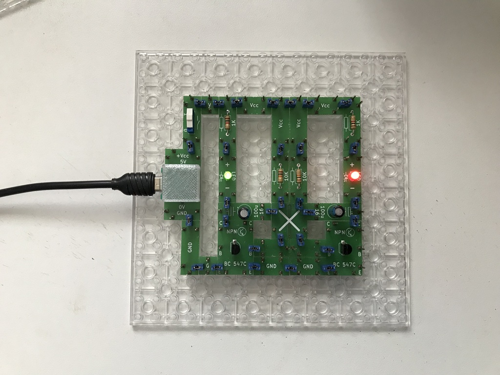

# Electronics With Bricks

## Flip-Flop

The flip-flop circuit provides two alternately flashing LEDs that are controlled by two coupled timers. The timing components are a resistor and a capacitor, and there are two transistors as switches and to drive the LEDs.

The circuit:

Copyright (c) 2024-2026 sun9qd

