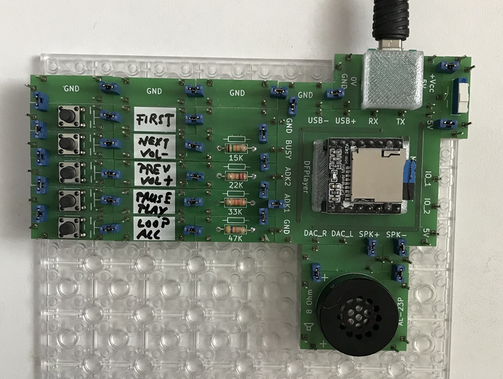

# Electronics With Bricks

## MP3 Player

In this experiment an integrated MP3 player is used that provides a direct loudspeaker output. The circuit is limited to controlling this component using a series of buttons and connecting a miniature loudspeaker.

Copyright (c) 2024-2026 sun9qd

