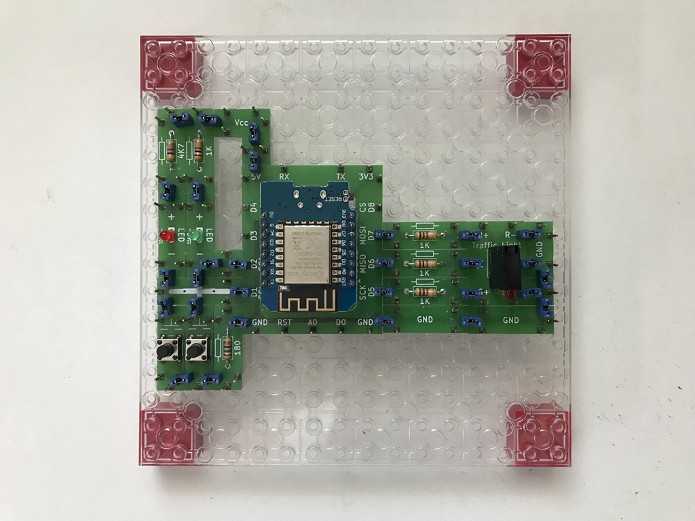
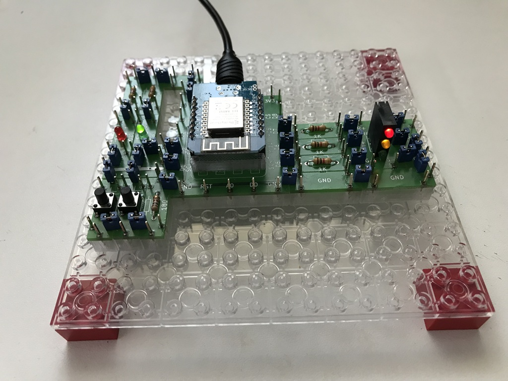

# Electronics With Bricks

## Traffic Light

In this setup, a D1 Mini microprocessor board controls a small traffic light. The user can influence the control system and switch the traffic light between normal operation and service mode using two push-buttons. 

The circuit:

In operation:

Copyright (c) 2024-2026 sun9qd

