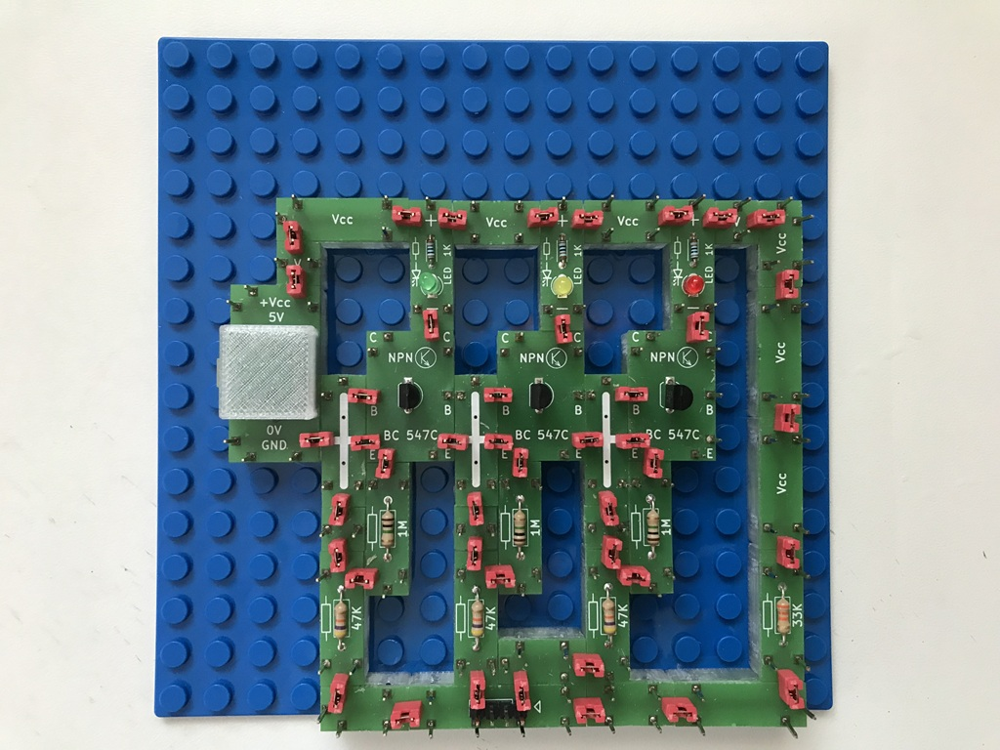
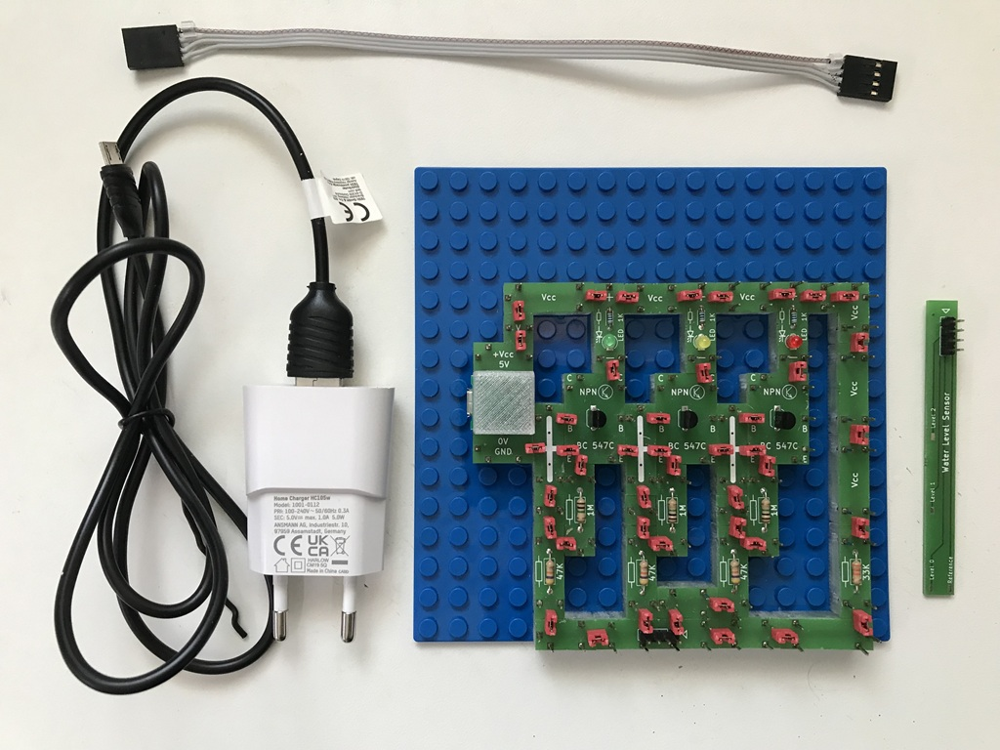
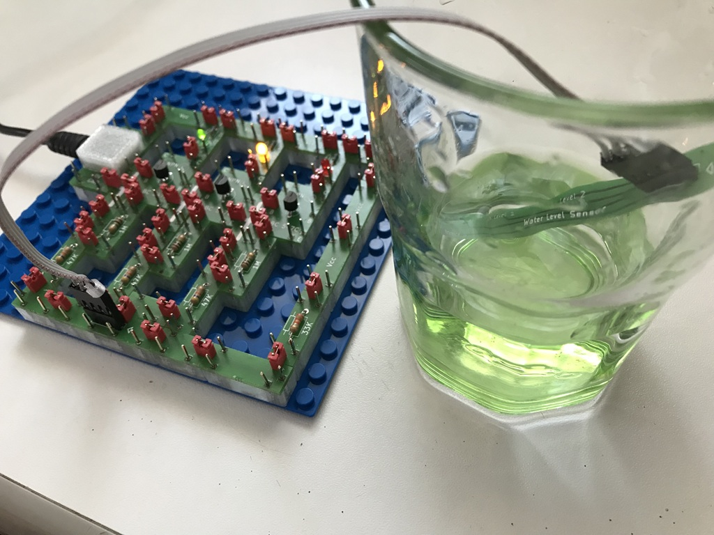

# Electronics With Bricks

## Water Level Detector

In this experiment, we build a circuit with which we can measure and display the water level in a water container, e.g. in a water glass or (with a modified sensor) in a rain barrel. The circuit uses analog components in the form of three npn transistors. The water level is displayed using LEDs.

The circuit:

The complete project with power supply and sensor:

In operation:

Copyright (c) 2024-2026 sun9qd

