# Electronics-With-Bricks: Brick Overview

The following is an overview of the available building blocks. The list may be incomplete and will be supplemented from time to time.

| | | |
|:-----------------------------|:---------------------------|:-----------------------------------------|
|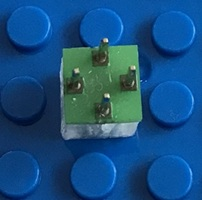|**Brick_1x1_Line**:|A piece of wire used to lay signal wires. Available variants: label "G" for ground, label "V" for supply voltage, no label for signals and for the general case.|
|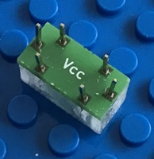|**Brick_2x1_LineVCC**:|A piece of wire used to lay VCC (the positive pole of supply voltage). Available variants: label "GND" for ground, label "VCC" for supply voltage, no label for signals and for the general case.|
|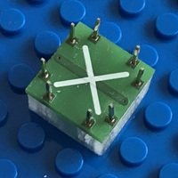|**Brick_2x2_Crossing**:|This brick allows to cross two wires without them having electrical contact.|
||**Brick_3x1_Capacitor_ce_50n**:|Ceramic disk capacitor 50 nF, min. 63V.|
|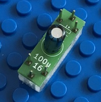|**Brick_3x1_Capacitor_el_100u16**:|Electrolytic disk capacitor 100uF/16V. Available variants of this brick: 22uF/16V, 100uF/16V, 220uF/16V.|
|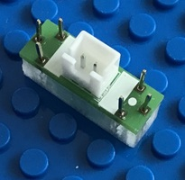|**Brick_3x1_Connector_JSTXH_2x1**:|Standard connector JST XH 2x1.|
|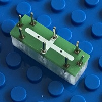|**Brick_3x1_Crossing**:|A second brick for crossing two lines without them having electrical contact to each other.|
|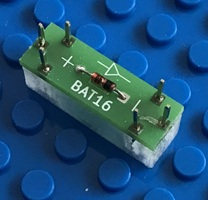|**Brick_3x1_Diode_BAT16**:|Universal low power diode BAT16.|
|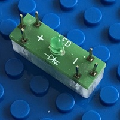|**Brick_3x1_LED_green**:|3mm LED green color. Available variants: 3mm LED red, 3mm LED yellow, 3mm LED green.|
|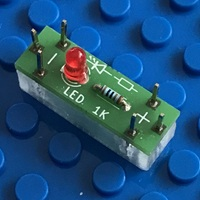|**Brick_3x1_LED_R_1K**:|3mm LED red color with 1K series resistor. Available variants: 3mm LED red + 1kOhm, 3mm LED yellow + 1kOhm, 3mm LED green + 1kOhm.|
|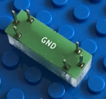|**Brick_3x1_LineGND**:|A piece of wire used to lay GND (the negative pole of supply voltage). Available variants: label "GND" for ground, label "VCC" for supply voltage, no label for signals and for the general case.|
|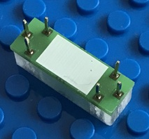|**Brick_3x1_Marker**:|A piece of wire which can be labelled by hand.|
|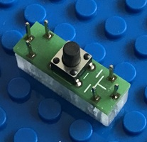|**Brick_3x1_PushButton**:|Standard push button.|
|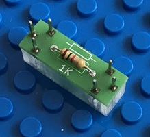|**Brick_3x1_Resistor_1K**:|Standard resistor 1 kOhm 250 mW. The following resistor Ohm values are available: 1, 10, 22, 47, 100, 180, 220, 470, 1K, 2K2, 4K7, 10K, 22K, 47K, 100K, 180K, 220K, 470K, 1M. |
|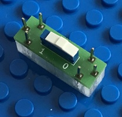|**Brick_3x1_Switch**:|A switch to turn an electrical connection on and off.|
|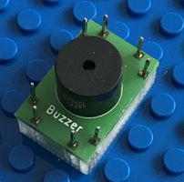|**Brick_3x2_Buzzer**:|This brick emits an alarm signal when voltage is applied.|
|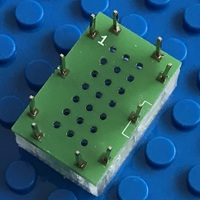|**Brick_3x2_PerfBoard_5x3**:|A perfboard for custom soldering.|
|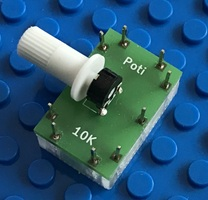|**Brick_3x2_Poti_horz_10K**:|Potentiometer 10 kOhm with horizontal axis. The following resistor values are available: 1K, 10K, 100K|
|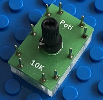|**Brick_3x2_Poti_vert_10K**:|Potentiometer 10 kOhm with vertical axis. The following resistor values are available: 1K, 10K, 100K|
|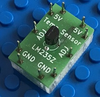|**Brick_3x2_TempSensor_LM235Z**:|Temperature sensor LM235Z.|
|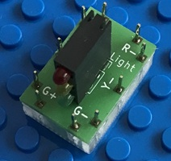|**Brick_3x2_TrafficLight**:|A small traffic light with red, yellow and green LEDs.|
|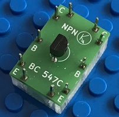|**Brick_3x2_Transistor_npn_BC547C**:|Universal transistor npn type BC547C.|
|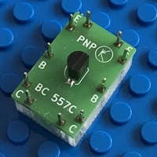|**Brick_3x2_Transistor_pnp_BC557C**:|Universal transistor pnp type BC557C.|
|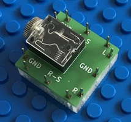|**Brick_3x3_JackSocket_EBS_35**:|3,5mm jack socket for connecting e.g. a computer headphone output to the circuit.|
|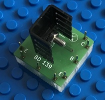|**Brick_3x3_Transistor_npn_BD139**:|Medium power npn transistor BD139.|
|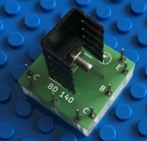|**Brick_3x3_Transistor_pnp_BD140**:|Medium power pnp transistor BD140.|
|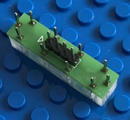|**Brick_4x1_Connector_PinHeader**:|Standard pin header 4x1 for use with ribbon cables. The following variants are available: 2x1, 3x1, 4x1, 6x1.|
|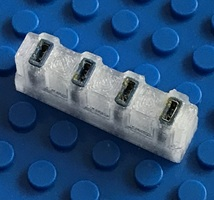|**Brick_4x1_SolderingSupport**:|Support tool for soldering the connector pins of the bricks. The following variants are available: 3x1, 4x1, 6x1, 8x1.|
|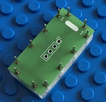|**Brick_4x2_UniversalConnector**:|Universal connector 4x1 to be populated by customer.|
|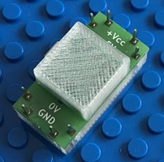|**Brick_4x2_USBPowerSupply**:|MicroUSB power supply. This brick contains a MicroUSB socket and loops out the 5V USB supply voltage.|
|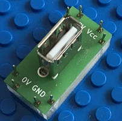|**Brick_4x2_USBTypVertical**:|USB type A connector. The brick loops out the 5V supply voltage.|
||**Brick_4x3_ADC_MCP3002**:|2 channel SPI analog digital converter.|
||**Brick_4x3_AudioAmp_LM386**:|Integrated  audio power amplifier for low power applications.|
|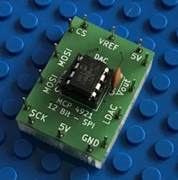|**Brick_4x3_DAC_MCP4921**:|1 channel DAC, SPI interface.|
|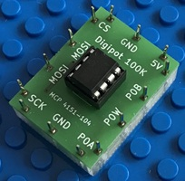|**Brick_4x3_Digipot_100K_MCP4151**:|Digital potentiometer MCP4151-104, 100KOhm, SPI interface. The following variant are available: 10K, 100K.|
||**Brick_4x3_DIP_8**:|A brick with a DIP-8 socket to be populated by the customer. The "T"-connectors provide a crossing lane below the socket.|
|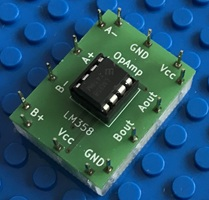|**Brick_4x3_OpAmp_LM358**:|OpAmp LM358 provides two operational amplifiers.|
|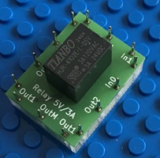|**Brick_4x3_Relay_5V_HJR_4102E**:|Relay HJR 4102E, 5V type.|
|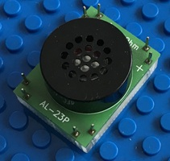|**Brick_4x3_Speaker_AL_23P**:|Miniature 8 Ohm loudspeaker AL-23P.|
|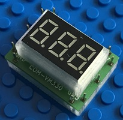|**Brick_4x3_Voltmeter**:|Voltmeter 0-30 Volt.|
|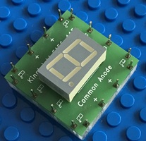|**Brick_4x4_7SegmentDigit**:|7 Segment digit, common anode.|
|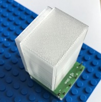|**Brick_4x4_SpeakerBox**:|Speaker box with 8 Ohm miniature loudspeaker LSM-20-M/N.|
|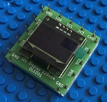|**Brick_5x5_Display_I2C_128x64_OLED01**:|I2C display 128x64.|
|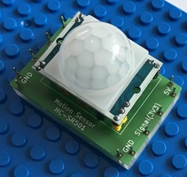|**Brick_6x4_MotionSensor_HC_SR501**:|Motion sensor HC-SR501.|
|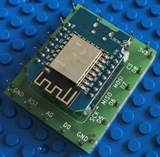|**Brick_6x5_D1mini**:|D1mini microcontroller board.|
|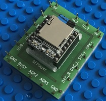|**Brick_6x5_DFPlayer**:|DFPlayer MP3 player.|
||**Brick_7x3_DIP_14**:|DIP-14 chip socket to be populated by the customer.|
||**Brick_7x3_HexInverter_CD74HCT**:|HexInverter and schmitt trigger CD74HCT.|
||**Brick_8x3_ADC_MCP3008**:|8-channel ADC MCP3008, SPI interface.|
||**Brick_8x3_DIP_16**:|DIP-16 chip socket to be populated by the customer.|
|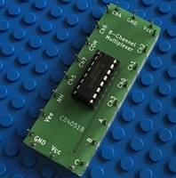|**Brick_8x3_Multiplexer_CD4051B**:|8-channel multiplexer.|
|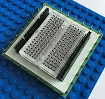|**Brick_8x8_Breadboard**:|This brick provides a small breadboard. You can set up small circuits or plug in chips or breakout boards (e.g. micro controller boards like D1mini or alike). You can select the breadboard strips you want to use on the brick connectors by connecting them to the female sockets (black colored on two sides of the brick in the picture) using standard breadboard jumper cables.|
||**Brick_9x3_DIP_18**:|DIP-18 chip socket to be populated by the customer.|
|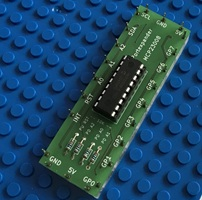|**Brick_9x3_PortExpander_MCP23008**:|8-channel port expander, I2C interface.|
||**Brick_9x5_RaspberryPico**:|Microcontroller Raspberry Pico or Raspberry Pico W (supporting WLAN).|
|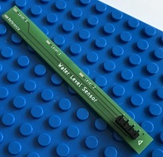|**Brick_10x1_WaterSensor**:|A simple sensor for measuring the water level in a glass of water.|

Copyright (c) 2024-2026 sun9qd

