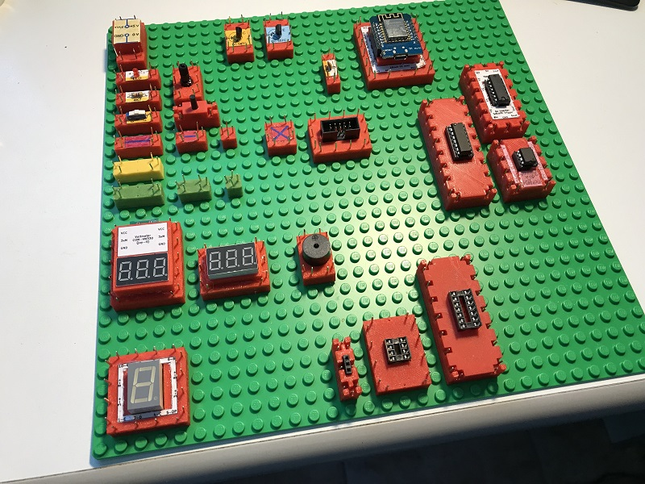
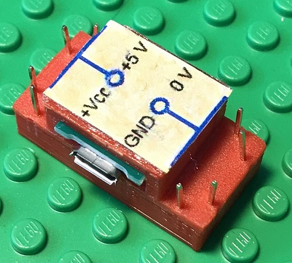
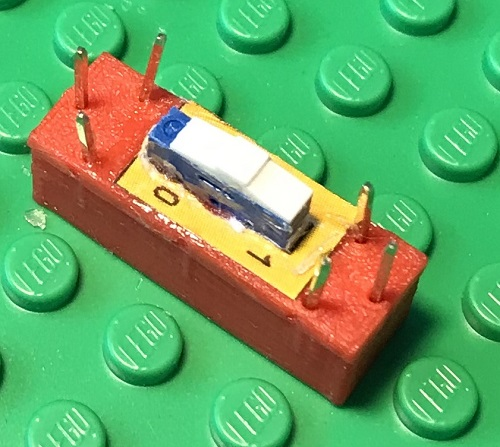
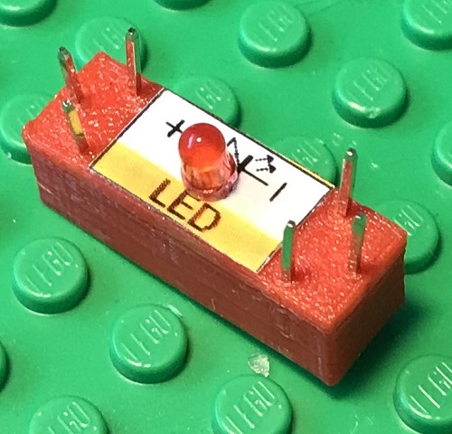
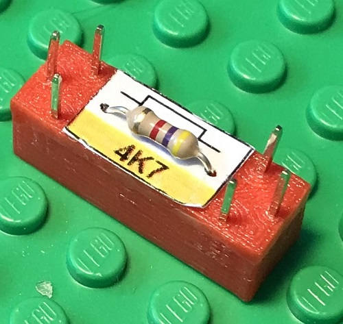
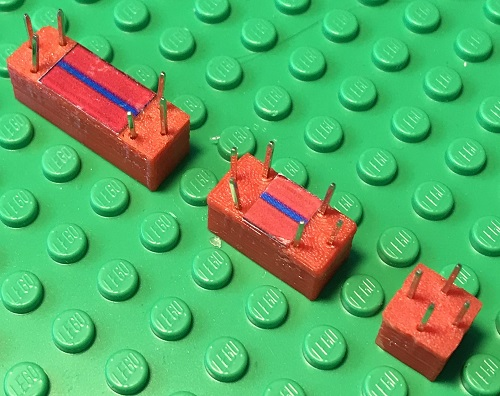
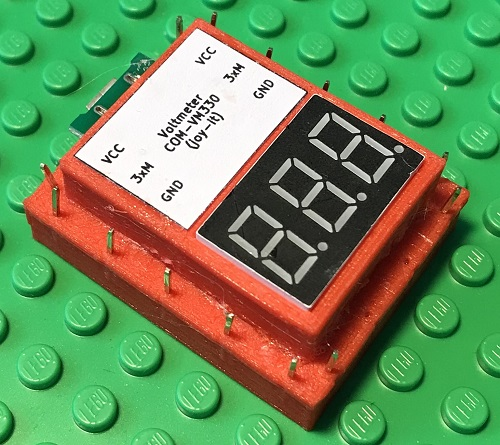
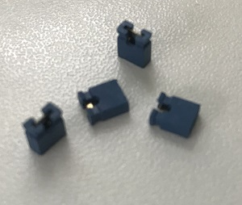

# Electronics With Bricks: Hello World!

This project presents an electronic construction kit with which simple analog and digital circuits can be built.

The kit is intended for:

1. Learning and training
2. Evaluation of electronic components
3. Development of electronic circuits

At the beginning, the first project is the "Hello World!" of electronics, a simple circuit with a power supply, switch and lamp. The following components of the kit are used and presented here:

| | |
|:--------------------------------------------------------|:-----------------------------------------|
||**MicroUSB power supply**: The module contains a MicroUSB socket, loops out the 5 volt supply voltage and makes it available at its connections.|
||**Switch Brick**: Switching an electrical connection on and off|
||**Light-emitting diode (LED) Brick**: A light-emitting diode as a lamp|
||**Resistor Brick**: A 1kOhm resistor as a series resistor for the light-emitting diode (The resistor in the picture shows a 4.7kOhm resistor instead).|
||**Line Brick**: Works like a piece of wire and connects electrically from one side to the other. The red line blocks are used in the general case and as signal lines.|
||**Voltmeter Brick**: A measuring device for displaying an electrical voltage.|
||**Jumper Plugs**: Standard jumpers are used to connect the modules electrically.|

And additionally:

* MicroUSB cable with charger: For connecting the MicroUSB power supply to a power outlet. A second MicroUSB cable and a second charger are required for the voltmeter module. The latter is important so that the measuring device is potential-free with respect to the circuit.
* Patch cable: Standard patch cable for connecting the measuring inputs of the voltmeter to the circuit

In the first step, the components are now plugged onto a standard base plate from the toy store (8mm studded plate, e.g. LEGO® base plate), as shown in the following picture:

The circuit is now fixed to the base plate. However, the circuit is not yet functional because the components are not yet electrically connected. The electrical connections are now made by connecting the connectors of neighboring components using jumper plugs:

The circuit is now complete and can be put into operation. To do this, the power supply component is connected to a power outlet using the micro USB cable with charger. After the switch is switched on, the LED lights up.

In addition, a voltmeter component can be used to measure the voltages of the circuit. The voltmeter is powered by its own microUSB cable and charger. The plus and minus measuring connections are connected to the circuit using a patch cable, e.g. as in the following picture:

The repository is structured as follows:

- bricks/ contains an overview of the available bricks
- sketches/ contains a number of simple experiments with the construction kit
- projects/ contains an overview of larger projects (with  links to the project repos) (still in preparation)
- resouces/ contains the resources for reproducing the described bricks (STL and Gerber files) (still in preparation)

Note:

LEGO® is a trademark of the LEGO Group. This project is not sponsored, approved or supported by the LEGO Group.

**Warning: The construction kit presented works with electricity. Incorrect use, but also faulty components, can cause fires and even people and animals can suffer injuries from electric shocks. For this reason, it may only be used by qualified persons.**

The 3D printing templates were created with OpenScad: https://openscad.org/

The board layouts were created with KiCad: https://www.kicad.org/

Some of the description text has been translated with the help of google translator: https://translate.google.com/

Copyright (c) 2024 sun9qd

