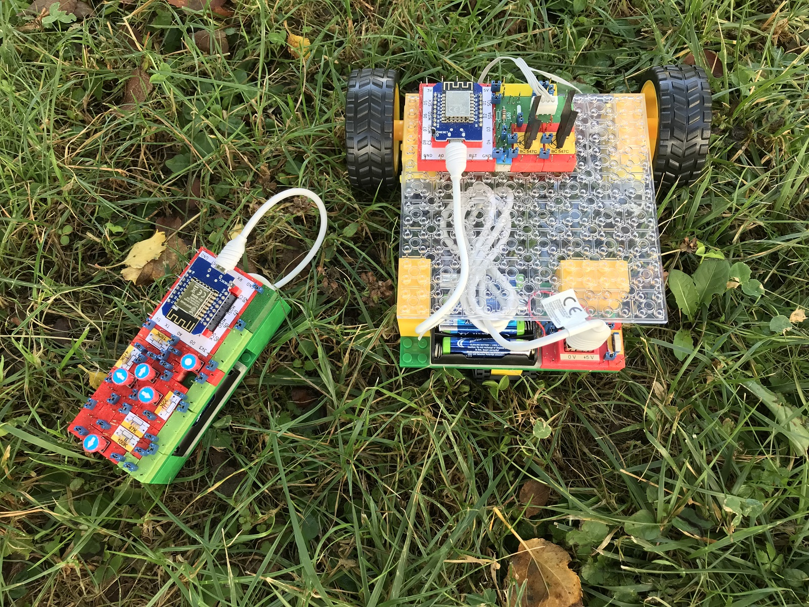

This project presents an electronic construction kit on 8 mm studded base panel, compatible with standard systems, supporting numerous analog and digital components. From this various analog and digital circuits can be built.

*The latest project built with the construction kit:* A remote-controlled robot car featuring two stacked electronic boards and plenty of space for additional sensor electronics. Details on the assembly will follow shortly.

The kit is intended for:

1. Learning and training
2. Evaluation of electronic components
3. Development of electronic circuits
4. Presentation of technical systems

Compared to using a breadboard, there are some advantages.

1. *Circuit layout  like a photograph of the circuit diagram.*
The wires can be freely routed in two dimensions, whereas on a breadboard, one direction is restricted by the fixed internal wiring. Components and connections are labeled. The tangle of wires is replaced by clearly identifiable jumper connectors.

2. *Robust construction—almost like a manufactured circuit board.*
The components hold firmly to the baseplate, and the jumper connections establish reliable electrical contact. No exposed wires posing a short-circuit risk. 

3. *It’s really fun working with it.*
Finding the best way to lay out the circuit on the base plate. It feels like an amazing, addictive game of skill.

The repository is structured as follows:

- **1_overview/** contains an overview of experiments
- **2_bricks/** contains an overview of the available bricks
- **3_projects/** contains a number of  projects with the construction kit
- **4_sets/** contains a number of assembly sets of the construction kit (Content of this directory mostly German language)
- **5_resources/** contains the resources for reproducing the bricks (STL and Gerber files) and a description how to do that
- **img/** contains images for driving this web side

Note:

LEGO® is a trademark of the LEGO Group. This project is not sponsored, approved or supported by the LEGO Group.

**Warning: The construction kit presented works with electricity. Incorrect use, but also faulty components or circuits, can cause fires and even people and animals can suffer injuries from electric shocks. For this reason, it may only be used by qualified persons.**

The 3D printing templates were created with OpenScad: https://openscad.org/

The board layouts were created with KiCad: https://www.kicad.org/

Some of the description text has been translated with the help of google translator: https://translate.google.com/

Copyright (c) 2024-2026 sun9qd

