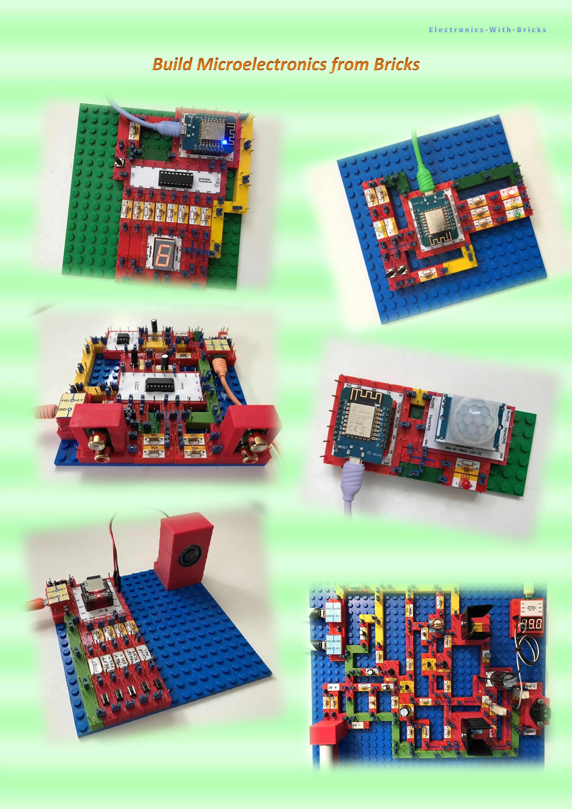
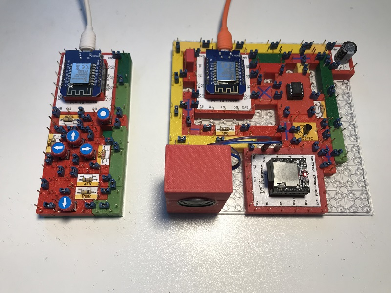

This project presents an electronic construction kit on LEGO®-compatible base plate with numerous analog and digital components. From this various analog and digital circuits can be built.

The latest project built with the construction kit: A remotely controlled MP3 player

The kit is intended for:

1. Learning and training
2. Evaluation of electronic components
3. Development of electronic circuits
4. Documentation and presentation of technical systems

Compared to using a breadboard, there are two advantages.

1. **The circuit layout looks like a photograph of the circuit diagram.**
The wires can be freely routed in two dimensions, whereas on a breadboard, one direction is restricted by the fixed internal wiring.

2. **A top-down photograph provides complete documentation of the circuit.**
Unlike a breadboard, all components and connections are labeled. The tangle of wires is replaced by clearly identifiable jumper connectors.

The repository is structured as follows:

- **1_overview/** contains an overview of experiments
- **2_bricks/** contains an overview of the available bricks
- **3_projects/** contains a number of  projects with the construction kit
- **4_sets/** contains a number of assembly sets of the construction kit (Content of this directory mostly German language)
- **5_resources/** contains the resources for reproducing the bricks (STL and Gerber files) and a description how to do that
- **img/** contains images for driving this web side

Note:

LEGO® is a trademark of the LEGO Group. This project is not sponsored, approved or supported by the LEGO Group.

**Warning: The construction kit presented works with electricity. Incorrect use, but also faulty components or circuits, can cause fires and even people and animals can suffer injuries from electric shocks. For this reason, it may only be used by qualified persons.**

The 3D printing templates were created with OpenScad: https://openscad.org/

The board layouts were created with KiCad: https://www.kicad.org/

Some of the description text has been translated with the help of google translator: https://translate.google.com/

Copyright (c) 2024-2026 sun9qd

