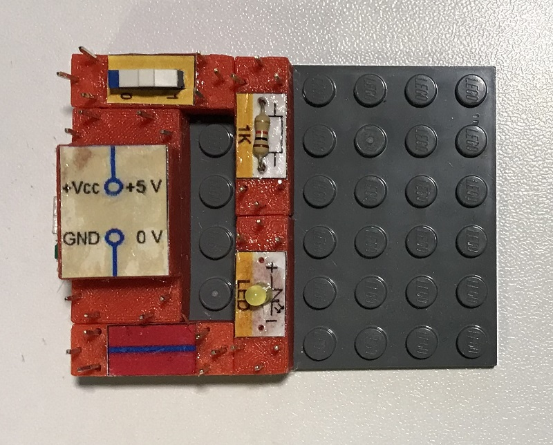
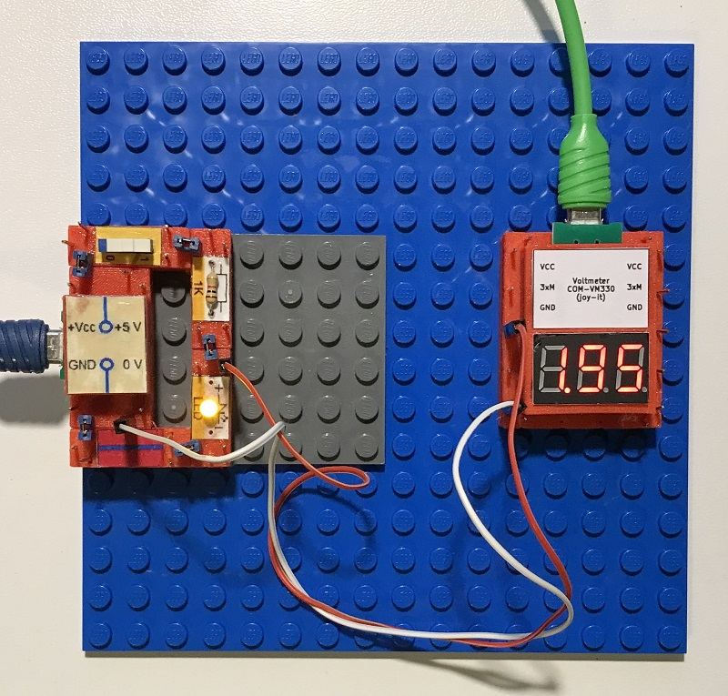

# Electronics With Bricks: Hello World!

Copyright (c) 2024 sun9qd

This repository presents an electronics kit with which simple analog and digital circuits can be built. The kit is intended for:

1. Learning and training
2. Evaluation of electronic components
3. Development of electronic circuits

You will find a description of already prepared experiments in the "experiments" subdirectory and a description of the available building blocks in the "bricks" subdirectory. The "resources" subdirectory contains the resources for replicating the described building blocks (STL and KiCad files). The provision of resources is not yet complete, but will come soon.

At the beginning, the first project is the "Hello World!" of electronics, a simple circuit with power supply, switch and lamp. The following components of the kit are used and presented here:

* MicroUSB power supply module: The module contains a MicroUSB socket, loops out the 5 volt supply voltage and makes it available at its connections.
* Switch module: A switch for turning an electrical connection on/off
* LED module: A light-emitting diode as a lamp
* Resistor module: A 1kOhm resistor as a series resistor for the light-emitting diode
* Line module: This module acts like a piece of wire
* Voltmeter module: A measuring device for displaying an electrical voltage
* Jumper: Standard jumpers are used to connect the modules electrically
* MicroUSB cable with charger: For connecting the MicroUSB power supply to a power outlet. A second MicroUSB cable and a second charger are required for the voltmeter module. The latter is important so that the measuring device is potential-free with respect to the circuit.
* Patch cable: Standard patch cable for connecting the measuring inputs of the voltmeter to the circuit

In the first step, the components are now plugged onto a standard base plate from the toy shop (8mm studded plate), as shown in the following picture:

The circuit is now fixed to the base plate. However, the circuit is not yet functional because the components are not yet electrically connected. The electrical connections are now made by connecting the connectors of neighboring components using jumper plugs:

The circuit is now complete and can be put into operation. To do this, the power supply component is connected to a power outlet using the micro USB cable with charger. After switching on the switch, the LED lights up.

In addition, a voltmeter component can be used to measure the voltages of the circuit. The voltmeter is powered by its own microUSB cable and charger. The plus and minus measuring connections are connected to the circuit using a patch cable, e.g. as in the following picture:

The 3D printing templates were created with OpenScad: https://openscad.org/

The board layouts were created with KiCad: https://www.kicad.org/

