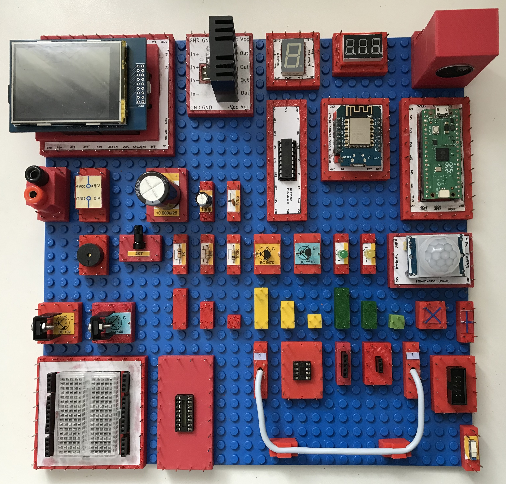

This project presents an electronic construction kit on LEGO®-compatible base plate with numerous analog and digital components. From this various analog and digital circuits can be built.

The kit is intended for:

1. Learning and training
2. Evaluation of electronic components
3. Development of electronic circuits

The repository is structured as follows:

- **assembly_sets/** contains a number of  experiments with the construction kit (Content of this directory mostly German language)
- **bricks/** contains an overview of the available bricks
- **resources/** contains the resources for reproducing the bricks (STL and Gerber files) and a description how to do that
- **sketches/** contains an overview of some additional experiments

Note:

LEGO® is a trademark of the LEGO Group. This project is not sponsored, approved or supported by the LEGO Group.

**Warning: The construction kit presented works with electricity. Incorrect use, but also faulty components, can cause fires and even people and animals can suffer injuries from electric shocks. For this reason, it may only be used by qualified persons.**

The 3D printing templates were created with OpenScad: https://openscad.org/

The board layouts were created with KiCad: https://www.kicad.org/

Some of the description text has been translated with the help of google translator: https://translate.google.com/

Copyright (c) 2024-2025 sun9qd

