# Electronics-With-Bricks: Brick Overview

The following is an overview of the available building blocks. The list is incomplete and will be supplemented.

| | |
|:--------------------------------------------------------|:-----------------------------------------|
|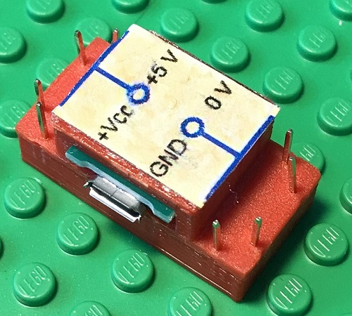|**MicroUSB power supply**: The power source is powered by a USB charger via a MicroUSB cable and provides 5V DC voltage. The building block contains a MicroUSB socket, loops out the 5 volt USB power supply and makes it available on its connection pins.|
|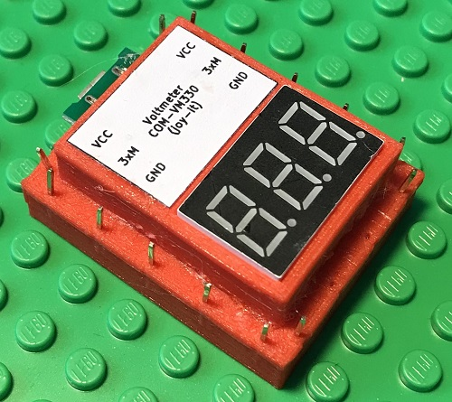|**Voltmeter**: This building block contains a measuring device for measuring electrical voltages. It is usually powered via a MicroUSB cable. A separate USB charger should preferably be used to ensure that there is no potential in relation to the circuit being measured.|
|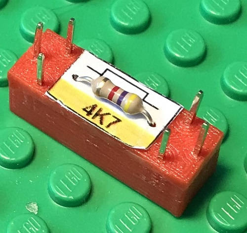|**Resistor**: Electrical resistors are available with different resistance values, which are indicated on the component using colored rings. In the picture, a resistor with 4.7 kOhm.|
|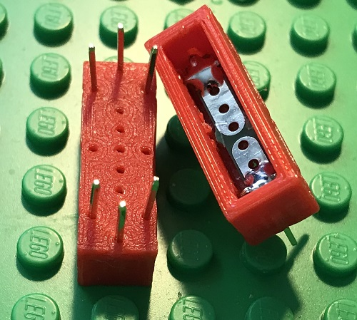|**Resistor Template**: This unpopulated brick can be used to create different functional bricks, e.g. resistor bricks, diode bricks and more.|
|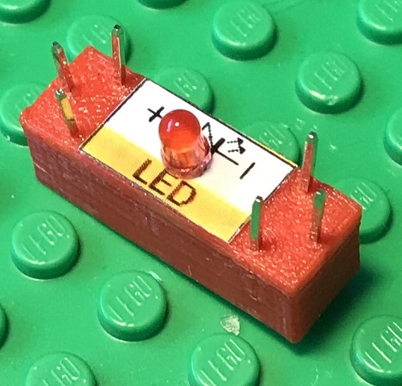|**Light-emitting diode (LED)**: In the picture, a red light-emitting diode that can produce red light. Other light-emitting diodes are green, yellow or other colors. Light-emitting diodes are polarized components that must be connected the right way round.|
|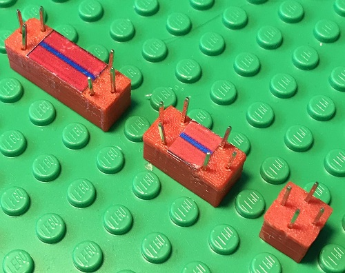|**(Signal) line**: Works like a piece of wire and connects electrically from one side to the other. The red line blocks are used in the general case and as signal lines.|
|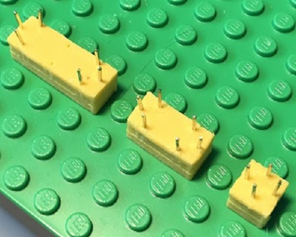|**Vcc line**: The yellow line blocks are used to lay the supply voltage|
|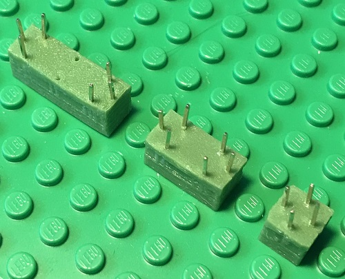|**Ground line**: The green line blocks are used to lay ground|
|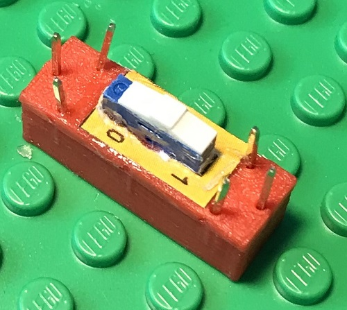|**Switch**: Switching an electrical connection on and off|
|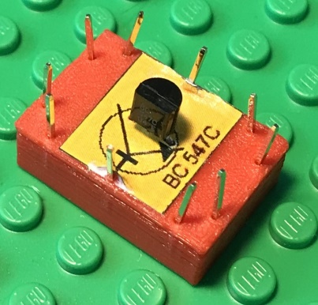|**Universal transistor NPN type**: Semiconductor component for use as an amplifier and as an electronic switch.|
|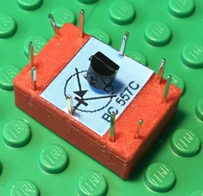|**Universal transistor PNP type**: Semiconductor component for use as an amplifier and as an electronic switch.|
|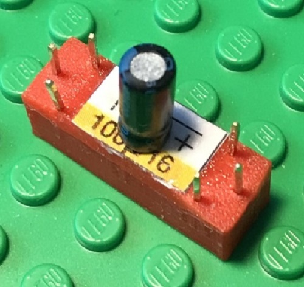|**Electrolytic capacitor**: Capacitor with high capacity but slow reaction speed.|
|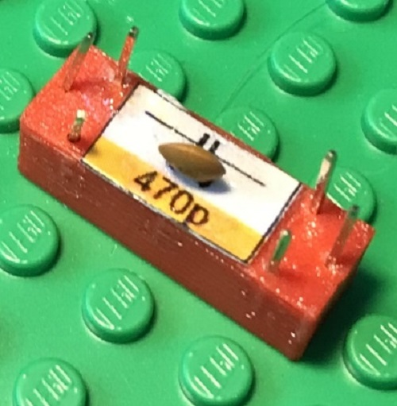|**Ceramic capacitor**: Capacitor with low capacity but high reaction speed.|
|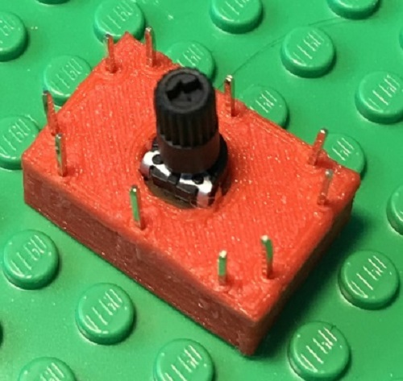|**Potentiometer**: A variable resistor (the component in the picture is still missing the label).|
|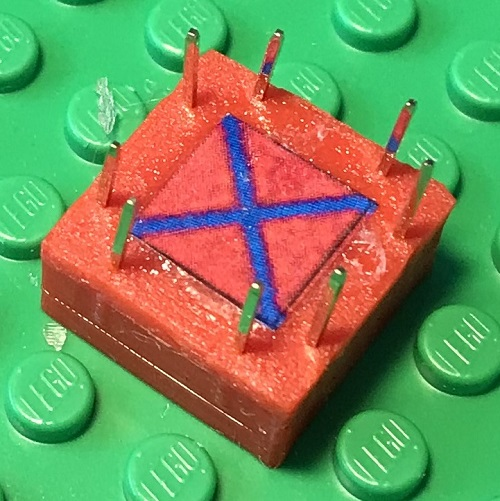|**Crossing diagonally**: This component allows two lines to be crossed without them being in contact with each other.|
|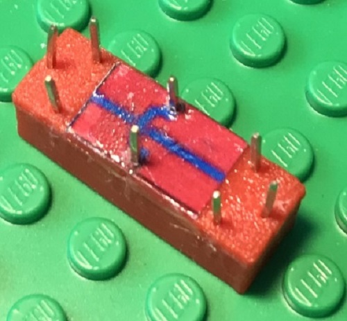|**Crossing**: A second crossing component for crossing two lines that are not in contact with each other.|
|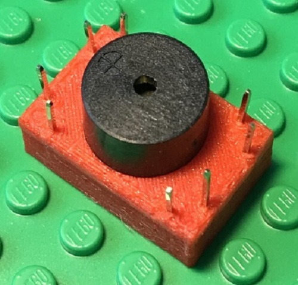|**Buzzer**: This component produces a beeping sound when voltage is applied.|
|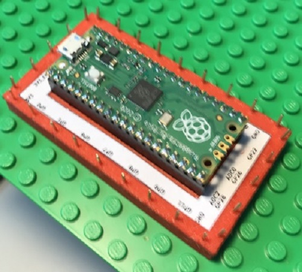|**Raspberry Pico**: A microcontroller board that is typically programmed from a PC via USB using a separate app with Python. There is a compatible version of the board with WiFi support that can alternatively be fitted into this component.|
|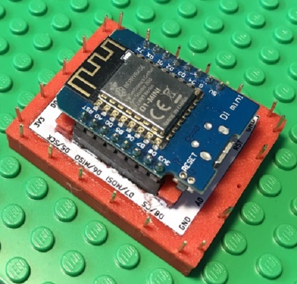|**D1 mini**: A microcontroller board with WiFi support that is typically programmed from a PC using the Arduino development environment in C++.|
||**DIP-8 Socket**: For the integration of any 8-pin chips.|
|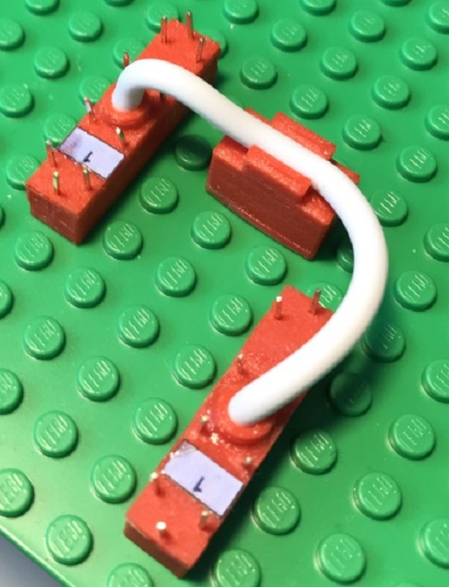|**Bus Wire**: This double brick can be used to route four connections over a longer distance. This is often a great help with bus connections (I2C bus, SPI bus). However, the component can also be used for other connections, e.g. to connect the supply voltage and ground connection to a remote point in the circuit. There are different versions of the component with different cable lengths.|
|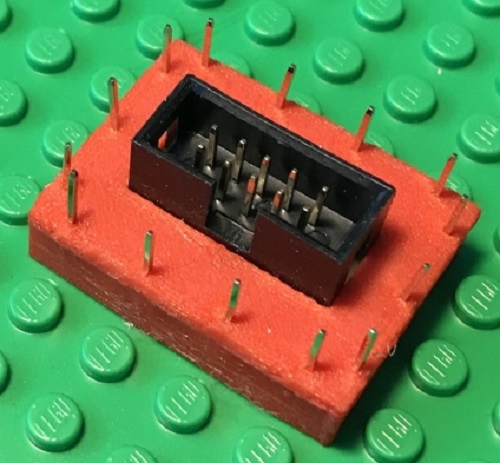|**Board Connector**: Using two of these modules and a suitable 10-pin ribbon cable, you can connect two circuits that are built on two different base plates ("boards").|
|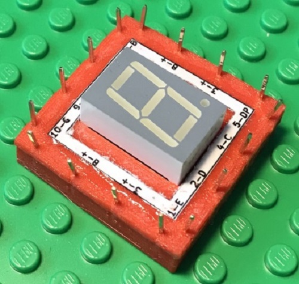|**7-Segment Display**: Display module for a 7-segment digit with decimal point. The anode (+pole) of the LEDs is connected together, the 8 cathodes are brought out separately.|
|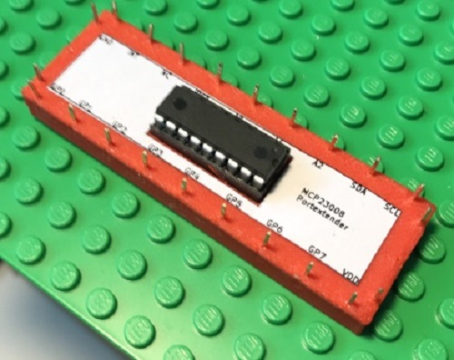|**MCP23008 - 8-bit IOExpander**: This component provides 8 GPIO ports (General Purpose Input/Output Ports) that can be used by a microcontroller via an i2c bus.|
|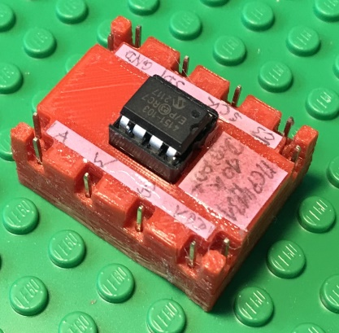|**Digital-Potentiometer ("Digipot")**: This component provides a potentiometer whose wiper position is set by a command from a microcontroller via an SPI bus. There are components with different resistance values; in the picture a type with 10 kOhm is shown.|

Copyright (c) 2024 sun9qd

