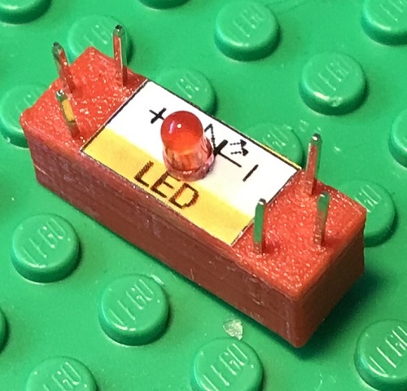
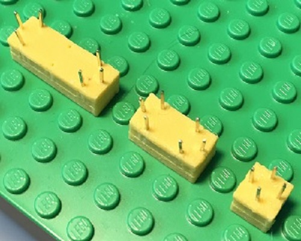
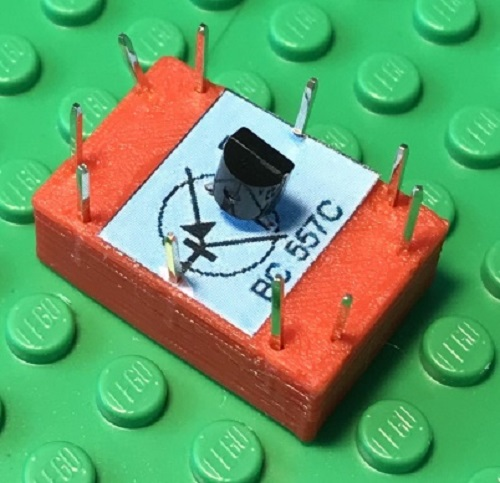

# Electronics-With-Bricks: Brick Overview

Copyright (c) 2024 sun9qd

The following is an overview of the available building blocks. The list is incomplete and will be supplemented.

| | |
|:--------------------------------------------------------|:-----------------------------------------|
||**MicroUSB power supply**: The power source is powered by a USB charger via a MicroUSB cable and provides 5V DC voltage. The building block contains a MicroUSB socket, loops out the 5 volt USB power supply and makes it available on its connection pins.|
||**Voltmeter**: This building block contains a measuring device for measuring electrical voltages. It is usually powered via a MicroUSB cable. A separate USB charger should preferably be used to ensure that there is no potential in relation to the circuit being measured.|
||**Resistor**: Electrical resistors are available with different resistance values, which are indicated on the component using colored rings. In the picture, a resistor with 4.7 kOhm.|
||**Light-emitting diode (LED)**: In the picture, a red light-emitting diode that can produce red light. Other light-emitting diodes are green, yellow or other colors. Light-emitting diodes are polarized components that must be connected the right way round.|
||**(Signal) line**: Works like a piece of wire and connects electrically from one side to the other. The red wire bricks are used in the general case and as signal lines.|
||**Vcc line**: The yellow wire bricks are used for routing the supply voltage|
||**Ground line**: The green wire bricks are used for routing ground|
||**Switch**: Switching an electrical connection on and off|
||**Universal transistor NPN type**: Semiconductor component for use as an amplifier and as an electronic switch.|
||**Universal transistor PNP type**: Semiconductor component for use as an amplifier and as an electronic switch.|
