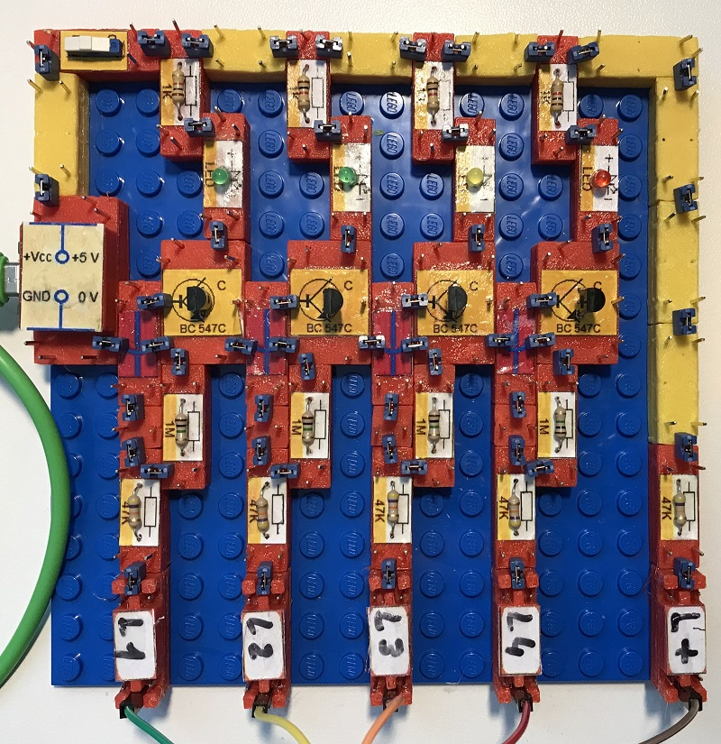
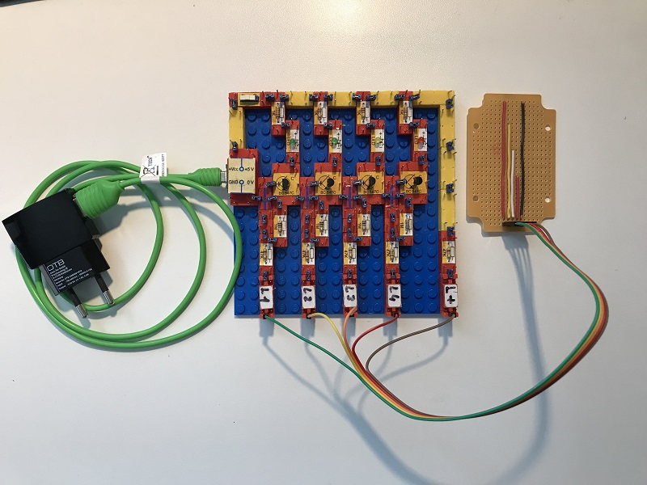
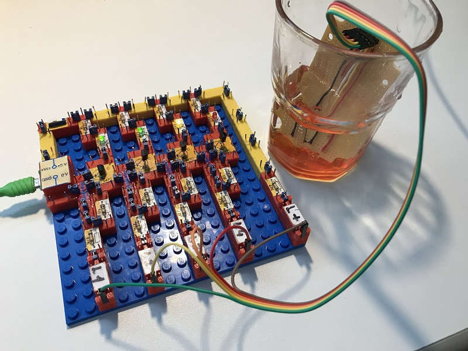
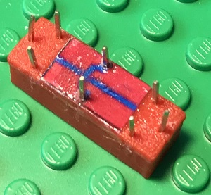

# Electronics With Bricks: Analog Water Level Indicator

Copyright (c) 2024 sun9qd

In this experiment, we build a circuit with which we can measure and display the water level in a water container, e.g. in a water glass or (with a modified sensor) in a rain barrel. The circuit uses analog components in the form of four npn transistors. The water level is displayed using light-emitting diodes.

This experiment also shows the use of colored line modules to improve the overview in the circuits. The yellow line modules are used for the operating voltage, the green ones for the ground line. The latter were not necessary here because the ground line is not switched separately, but is routed via red function modules.

The circuit:

The whole project, with power supply and sensor:

In operation:

In this experiment, a crossing block is used that makes it possible to cross two wires without them having electrical contact:

The crossing block has three pads, with the two outer ones connected to each other inside the block, while the middle one has no connections. In this way, the crossing connection can be switched via the middle pad with its two connectors.