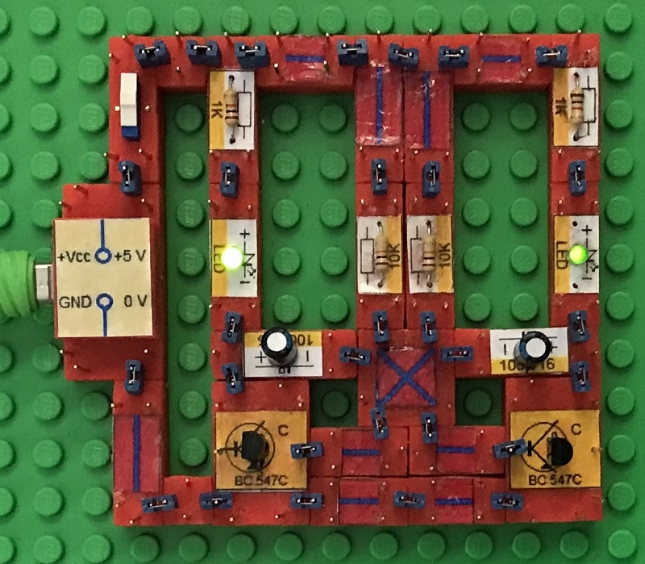

# Electronics With Bricks: Flip-Flop

Copyright (c) 2024 sun9qd

The most striking thing about the flip-flop circuit or "blinking circuit" are two alternately flashing LEDs that are controlled by two coupled timers. The timing components are a resistor and a capacitor and there is a transistor each as a switch and to drive the LEDs.

The circuit:

