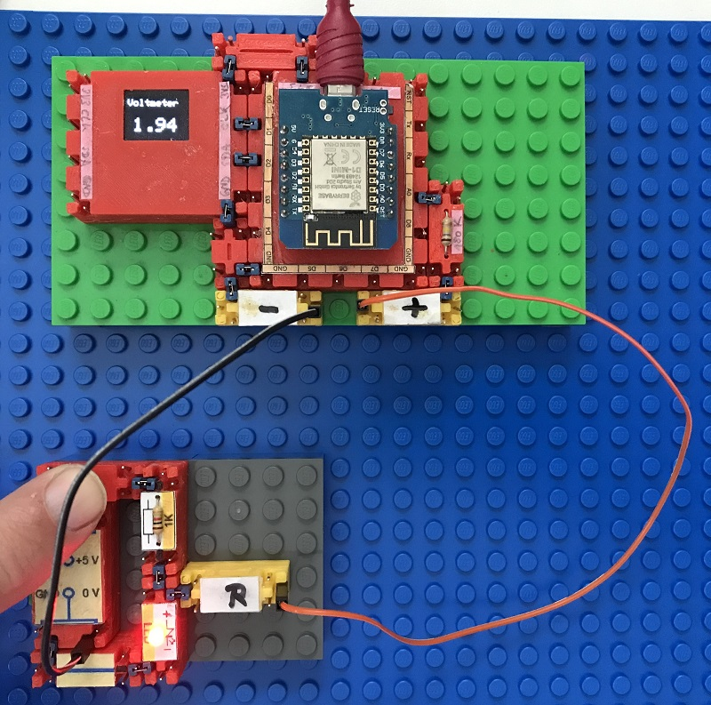

# Electronics With Bricks: Voltmeter

In this experiment we build a voltmeter to measure electrical voltages.

The voltage is measured with an ADC (analog-digital converter) that is built into the D1-Mini microcontroller board.

The measured voltage is displayed on a small graphic display that is connected to the microcontroller via i2c.

In operation:

Copyright (c) 2024 sun9qd

