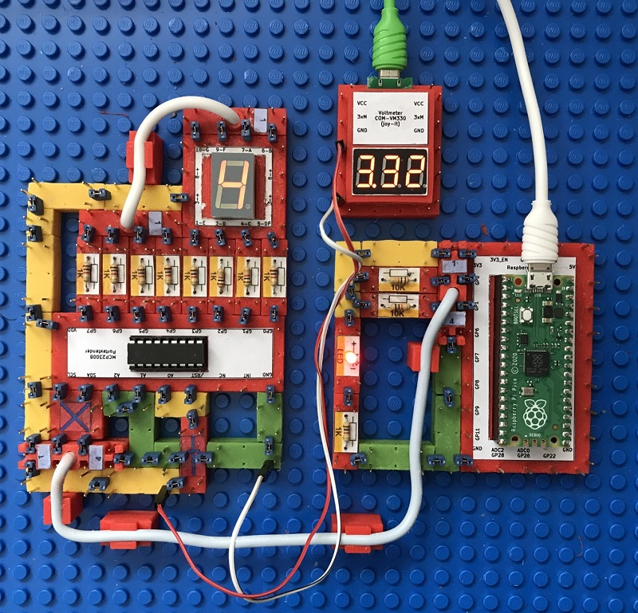
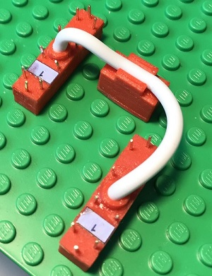

# Electronics With Bricks: 7-Segment Display

Copyright (c) 2024 sun9qd

This experiment is about displaying a single digit, controlled by a Raspberry Pico microcontroller. The microcontroller sends commands via an i2c bus to a port extender chip to set its IO ports so that the desired segments of the display module light up.

The yellow wire modules are used for the operating voltage, the green ones for the ground line. At the top right of the setup you can see a voltmeter module that measures the operating voltage.

The circuit in operation, the controlled display counts up in 1-second steps:

In this experiment, a bus line double brick is used to route Vcc, Ground, SCL and SDA from the microprocessor to the IO extender chip. A second of these double bricks routes the top 4 connections of the display module down to the IO extender chip.

