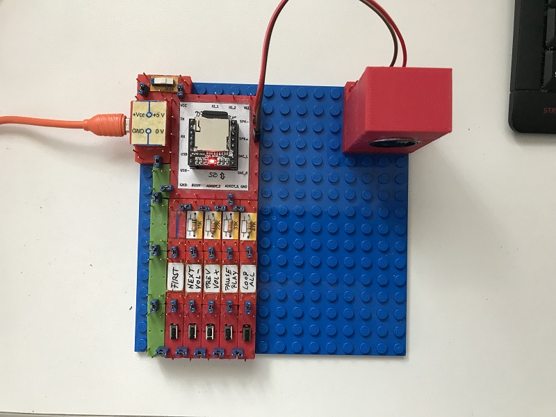
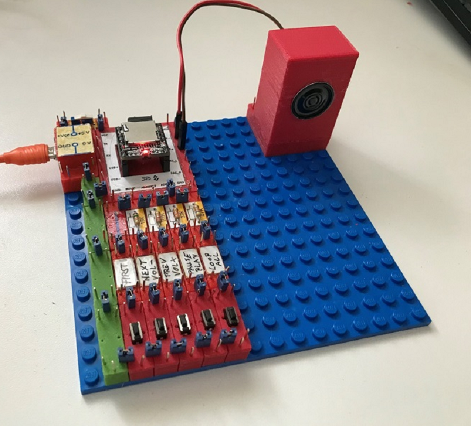

# Electronics With Bricks: MP3 player

In this experiment, an integrated MP3 player is used that provides a direct speaker output. The circuit is limited to controlling this component using a series of buttons and connecting a miniature speaker.

Copyright (c) 2024 sun9qd

