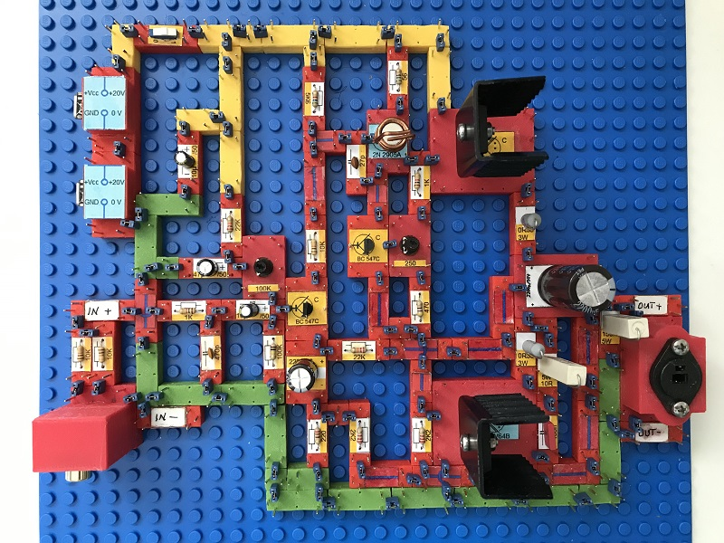
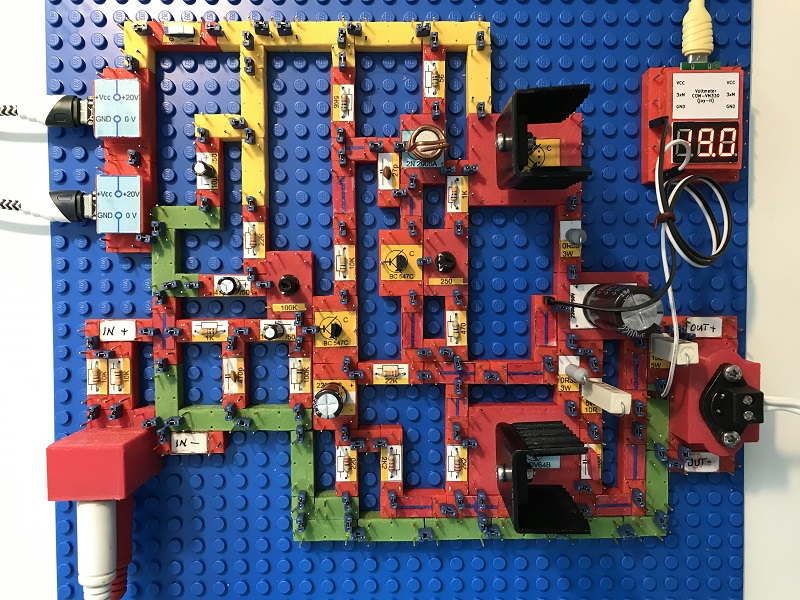

# Electronics With Bricks: Power Amplifier
Copyright (c) 2024 sun9qd

This time I'm trying something more challenging. Building a power amplifier with discrete components can cause various problems. For this reason, I use a tried and tested and simple circuit that was published many years ago by Elrad magazine under the name "Black Devil". I found the circuit here:

[https://www.diyaudio.com/community/attachments/black-devil-ii-pdf.146280/](https://www.diyaudio.com/community/attachments/black-devil-ii-pdf.146280/)

The result is impressive. Despite the weak power supply (2 USB chargers PD with 20 volts/30 watts each) and despite the small heat sinks, the amplifier delivers clear sound and powerful bass on my 100 watt bass reflex box. You just have to be careful with the heating of the power amplifier transistors, so don't turn them up too high!

As usual, the yellow line blocks are used for the operating voltage, the green ones for the ground line.

The circuit:

In operation, the voltmeter measures the amplifier's center voltage, which should be half the operating voltage:

