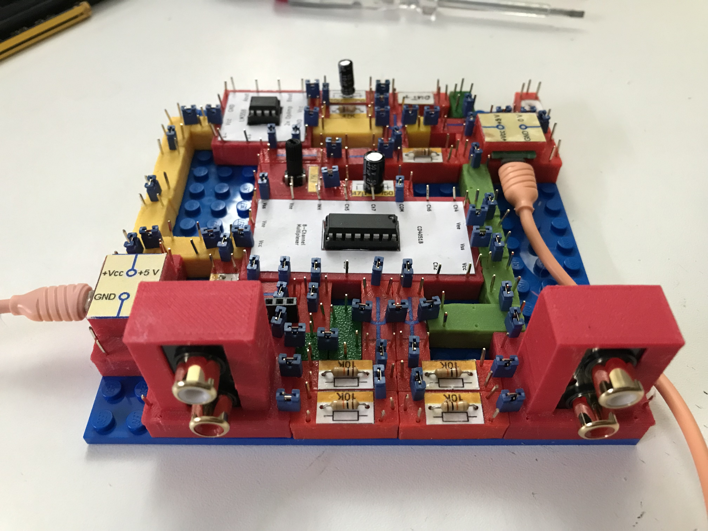
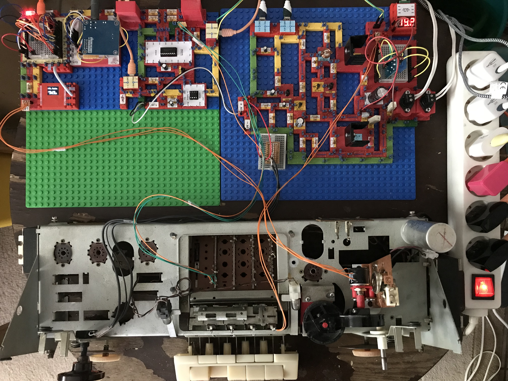

# Electronics With Bricks: Projects

I myself use the electronic construction kit for a number of private projects that I would like to present in separate repositories. Here is a brief overview:

## Tube radio goes WLAN

After I found an old, broken tube radio in the attic, I had to think of my youth, when we had great fun with the speakers from such old devices together with homemade amplifiers.

Here is the radio I found:

So I came up with the plan to build a modern radio using the chassis of the old radio including speakers and the controls on the front.

To do this, the most of the internal structure of the radio has to be removed and replaced with modern electronics. To test the new electronics, I will first build them using the electronics kit. Later, a circuit board will be designed that can be installed in the radio chassis.

The first step of the project looked likes this:

The new radio functionality is implemented on two breadboard bricks, the first carries a D1 mini mcu, the second carries a VS1053 mp3 module. The software of the mcu is based on Edzelf's internet radio solution. The audio signal is then forwarded to a "black devil" power amplifier, also built using bricks. The output of the power amplifer is connected to the main load speaker of the old radio. The two tweeters are connected through a 2.2 uF capacitor, because they are electro static type which require approx. 250V DC (created on a small extra board from the original trafo output voltage). And it works!

In the next step the following improvements were achieved:
- The old electronic components were removed and the chassis was cleaned
- The output of the power amplifier is switched by a relais now so the user can select between the internal speaker vs an external speaker box. The  switching is done via the "FANT" key on the front of the radio which was originally used to switch a special radio antenna on and of.
- The original radio used variable capacitors for station selection. These were replaced by potentiometers in order to produce a voltage corresponding to the currently selected radio station. The potentiometer voltage output is connected to the ADC (analog digital converter) of the MCU and selects from that a radio station out of a predefined list of stations.
- A preamplifier with two input channels was added. One of the inputs is connected to the microporcessor's music output, i.e. the radio signal. The second input  is used as an AUX entry, where e.g. the headphone output of a computer can be connected. The selection of the active input is done via the front selection key "PHONO" which originally selected an external phono device as input. The electronic component used as input switch is a CD4051B multiplexer chip.

The preamplifier:

The current project state:

The next steps will be:
- retrieve all settings of the frontplate and forward them via a port expander chip to the MCU
- adding sound control - bass and treble - to be connected to the corresponding controls on the front panel

The radio project can be found here: (not yet available)

## Monitoring automatic water pump

In our basement I have a problem with the condensate from our heating system. Up until now this water ran into a bucket that had to be emptied regularly. For some time now I have installed a water pump that records the water level and, when a certain water level is reached, pumps the water out through a hose into the drain of a sink.

This is what the solution looks like in my basement:

So far, so good. But in order to be able to check at any time whether this mechanism is working properly, I would like to have the water level in the bucket in question recorded. I would also like to be able to see how the water level has developed for some time in the past.

You can follow the development of this project here: (not yet available)

Copyright (c) 2024 sun9qd

