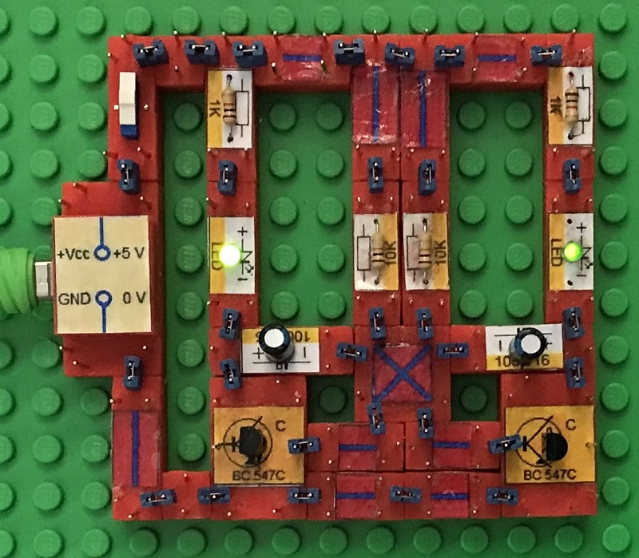
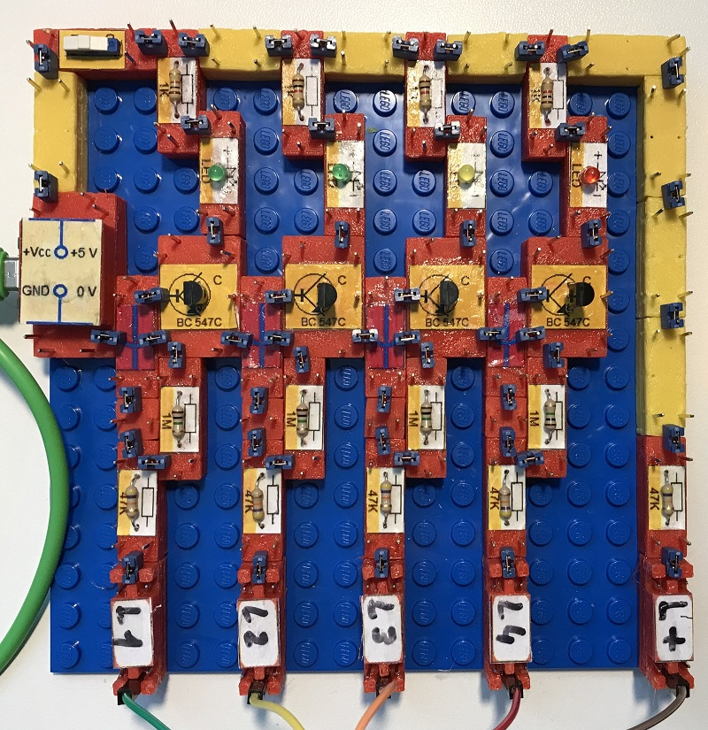
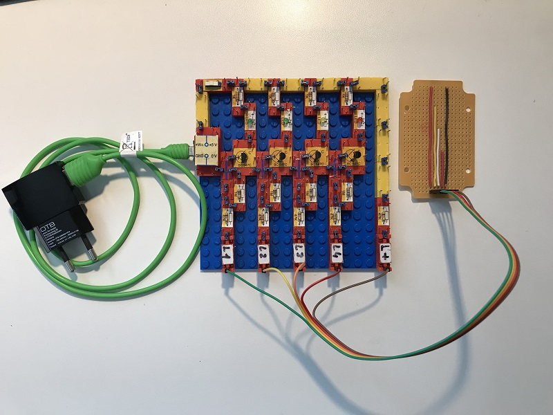
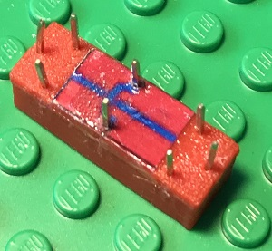
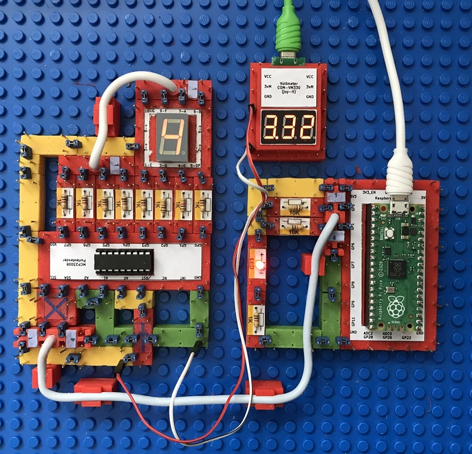
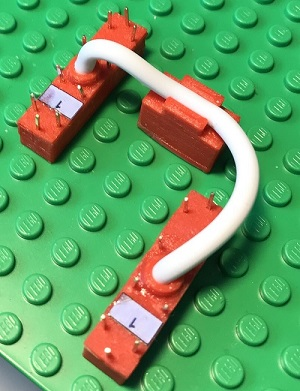
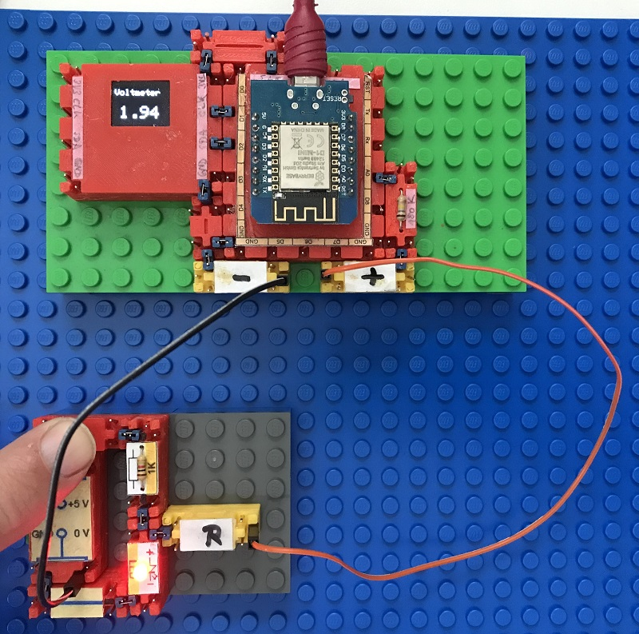
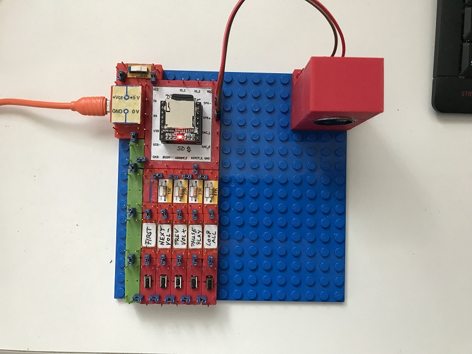
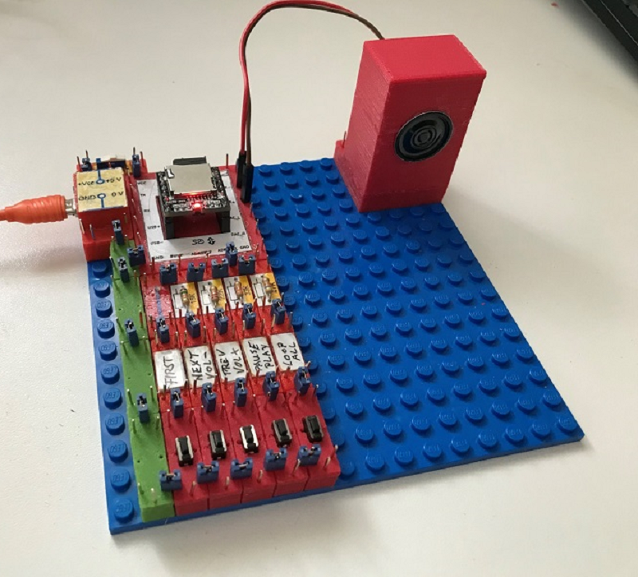
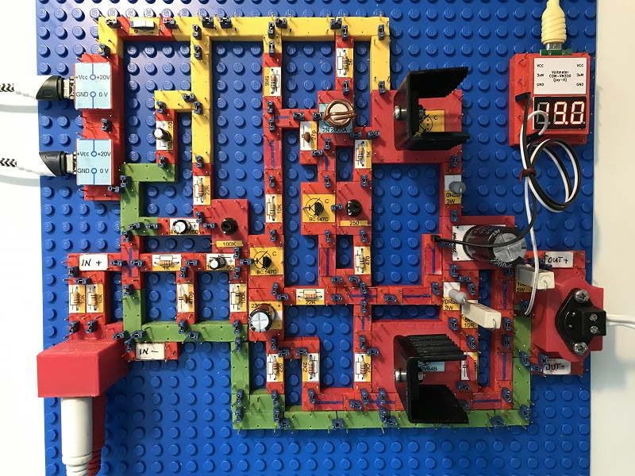

# Electronics With Bricks: Sketches

## Flip-Flop

The most striking thing about the flip-flop circuit or "blinking circuit" are two alternately flashing LEDs that are controlled by two coupled timers. The timing components are a resistor and a capacitor, and there is a transistor as a switch and to drive the LEDs.

The circuit:

## Analog water level indicator

In this experiment, we build a circuit with which we can measure and display the water level in a water container, e.g. in a water glass or (with a modified sensor) in a rain barrel. The circuit uses analog components in the form of four npn transistors. The water level is displayed using LEDs.

This experiment also shows the use of colored wiring blocks to improve the overview in the circuits. The yellow line blocks are used for the operating voltage, the green ones for the ground line. The latter were not necessary here because the ground line is not switched separately, but is routed via red function blocks.

The circuit:

The entire project, with power supply and sensor:

In operation:

In this experiment, a crossing block is used that makes it possible to cross two lines without them having electrical contact:

The crossing block has three pads, with the two outer ones connected to each other inside the block, while the middle one has no connections. In this way, the crossing connection can be switched via the middle pad with its two connectors.

## 7-Segment Display

This experiment is about displaying a single digit, controlled by a Raspberry Pico microcontroller. The microcontroller sends commands via an i2c bus to a port extender chip to set its IO ports so that the desired segments of the display module light up.

The yellow line modules are used for the operating voltage, the green ones for the ground line.

At the top right of the structure you can see a voltmeter module that measures the operating voltage.

The circuit in operation, the controlled display counts up in 1-second steps:

In this experiment, a bus line module is used to route Vcc,Ground,SCL and SDA from the microprocessor to the IO extender module. A second of these components redirects the top 4 connections of the display module downwards to the IO extender component.

## Voltmeter

In this experiment we build a voltmeter to measure electrical voltages.

The voltage is measured with an ADC (analog-digital converter) that is built into the D1-Mini microcontroller board.

The measured voltage is displayed on a small graphic display that is connected to the microcontroller via i2c.

## MP3 player

In this experiment an integrated MP3 player is used that provides a direct loudspeaker output. The circuit is limited to controlling this component using a series of buttons and connecting a miniature loudspeaker.

## Power Amplifier

This time I'm trying something more sophisticated. Building a power amplifier with discrete components can cause various problems. For this reason, I'm using a tried and tested and simple circuit that was published under the name "Black Devil" by Elrad magazine many years ago. I found the circuit here:

[https://www.diyaudio.com/community/attachments/black-devil-ii-pdf.146280/](https://www.diyaudio.com/community/attachments/black-devil-ii-pdf.146280/)

The result is impressive. Despite the weak power supply (2 USB chargers PD with 20 volts/30 watts each) and despite the small heat sinks, the amplifier delivers clear sound and powerful bass on my 100 watt bass reflex box. You just have to be careful with the heating of the power amplifier transistors, so don't turn the volume up too high!

As usual, the yellow line components are used for the operating voltage, the green ones for the ground line.

The circuit:

In operation, the voltmeter measures the center voltage of the amplifier, which should be half the operating voltage:

Copyright (c) 2024 sun9qd

